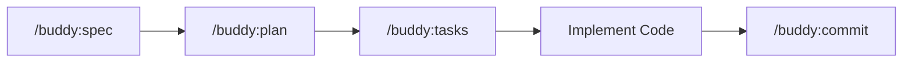
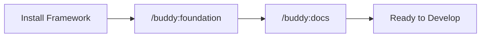

# Claude Buddy Technical Documentation

Welcome to the Claude Buddy technical documentation. This comprehensive guide covers architecture, usage, development, deployment, and troubleshooting.

## What is Claude Buddy?

Claude Buddy is an AI assistant configuration framework that enhances Claude Code with specialized personas, automated workflows, and intelligent context management. It provides:

- **12 Specialized Personas**: Expert perspectives from architecture to QA
- **Safety-First Automation**: Python-based hooks protect against dangerous operations
- **Template-Driven Workflows**: Spec → Plan → Tasks → Docs generation
- **Foundation-Based Development**: Principles-driven project alignment
- **Multi-Layer Protection**: File protection and command validation

## Quick Start

New to Claude Buddy? Start here:

1. **[Development Setup](./development-setup.md)** - Install and configure Claude Buddy
2. **[API Examples](./api-examples.md)** - Real-world usage examples
3. **[API Endpoints](./api-endpoints.md)** - Command reference

### 5-Minute Quick Start

```bash
# 1. Prerequisites
python --version  # >= 3.8
uv --version
claude --version

# 2. Install
cp -r /path/to/claude-buddy/.claude .
cp -r /path/to/claude-buddy/.claude-buddy .

# 3. Enable hooks
cat > .claude/settings.local.json << 'EOF'
{"hooks": {"enabled": true}}
EOF

# 4. Create foundation
/buddy:foundation interactive

# 5. Generate documentation
/buddy:docs

# 6. Start using personas
/buddy:persona How do I optimize database queries?
```

## Table of Contents

### Architecture

Understand how Claude Buddy works:

- **[Overview](./architecture-overview.md)** - High-level system architecture, design principles, request flow
- **[Components](./architecture-components.md)** - Commands, agents, personas, hooks, templates
- **[Data Flow](./architecture-data-flow.md)** - Information flow through system, workflow patterns
- **[Technology Stack](./architecture-technology-stack.md)** - Technologies, tools, dependencies

### API Documentation

Learn the Claude Buddy "API":

- **[Authentication](./api-authentication.md)** - Access control, file protection, command validation
- **[Endpoints](./api-endpoints.md)** - Complete command reference (`/buddy:*` commands)
- **[Schemas](./api-schemas.md)** - Configuration file schemas, hook protocols
- **[Examples](./api-examples.md)** - Real-world usage patterns, workflows

### Development

Build and customize Claude Buddy:

- **[Setup](./development-setup.md)** - Installation, configuration, verification
- **[Coding Standards](./development-coding-standards.md)** - Code style, best practices, conventions
- **[Testing](./development-testing.md)** - Testing strategies, test automation
- **[Debugging](./development-debugging.md)** - Debugging tools, common issues, performance

### Deployment

Deploy Claude Buddy to your environment:

- **[Prerequisites](./deployment-prerequisites.md)** - System requirements, dependencies, permissions
- **[Configuration](./deployment-configuration.md)** - Environment-specific configuration
- **[Deployment](./deployment-deployment.md)** - Deployment procedures, CI/CD integration
- **[Monitoring](./deployment-monitoring.md)** - Logging, metrics, maintenance

### Troubleshooting

Resolve issues quickly:

- **[Common Issues](./troubleshooting-common-issues.md)** - Quick fixes for frequent problems
- **[Performance](./troubleshooting-performance.md)** - Performance optimization, profiling
- **[FAQ](./troubleshooting-faq.md)** - Frequently asked questions

## Common Workflows

### Feature Development



**Steps**:
1. **Define requirements**: `/buddy:spec Add user authentication`
2. **Plan implementation**: `/buddy:plan`
3. **Break into tasks**: `/buddy:tasks`
4. **Implement following tasks**
5. **Commit professionally**: `/buddy:commit`

See: [API Examples - Feature Development](./api-examples.md#feature-development-examples)

### Project Initialization



**Steps**:
1. **Install Claude Buddy**: Copy `.claude/` and `.claude-buddy/`
2. **Create foundation**: `/buddy:foundation interactive`
3. **Generate documentation**: `/buddy:docs`
4. **Start developing**: Use personas and workflows

See: [Development Setup](./development-setup.md)

### Getting Expert Help

```bash
# Auto-activation (recommended)
/buddy:persona How do I secure my API?

# Manual selection
/buddy:persona security backend - Review authentication implementation

# Multiple perspectives
/buddy:persona architect performance - Design high-traffic system
```

See: [API Endpoints - Persona Command](./api-endpoints.md#buddypersona)

## Key Features

### Safety Hooks

Multi-layer protection against dangerous operations:

**File Protection**:
- Blocks `.env`, `*.key`, `secrets.*`, SSH keys, AWS credentials
- Customizable patterns and whitelists
- Strict mode for production

**Command Validation**:
- Blocks `rm -rf /`, `sudo rm`, fork bombs, disk operations
- Performance warnings
- Best practice suggestions

See: [API Authentication](./api-authentication.md)

### Persona System

12 specialized personas providing domain expertise:

**Technical Specialists**:
- `architect` - Systems design, scalability
- `frontend` - UI/UX, accessibility
- `backend` - APIs, databases
- `security` - Threat modeling, vulnerabilities
- `performance` - Optimization, bottlenecks

**Process Experts**:
- `analyzer` - Debugging, root cause analysis
- `qa` - Testing strategies, quality assurance
- `refactorer` - Code quality, technical debt
- `devops` - Infrastructure, deployment
- `po` - Requirements, product strategy

**Knowledge Specialists**:
- `mentor` - Teaching, knowledge transfer
- `scribe` - Documentation, technical writing

See: [Architecture Components - Persona System](./architecture-components.md#persona-system)

### Foundation-Driven Development

All development aligns with project foundation:

- **Purpose**: Mission and value proposition
- **Core Principles**: 5 foundational principles
- **Requirements**: Specific requirements per principle
- **Rationale**: Why each principle matters
- **Compliance**: How to verify adherence

See: [Architecture Overview - Foundation](./architecture-overview.md#high-level-design-principles)

### Template-Driven Generation

Foundation-specific templates for different tech stacks:

- **default**: Generic software projects
- **jhipster**: JHipster full-stack applications
- **mulesoft**: MuleSoft integration projects

Each template defines:
- Analysis commands
- Output structure
- Content patterns
- Quality assurance

See: [Architecture Components - Template System](./architecture-components.md#template-system)

## Command Reference

### All Available Commands

| Command | Purpose | Prerequisites |
|---------|---------|---------------|
| `/buddy:persona` | Activate specialized personas | None |
| `/buddy:foundation` | Create/update project foundation | None |
| `/buddy:spec` | Generate feature specification | Foundation |
| `/buddy:plan` | Create implementation plan | Spec |
| `/buddy:tasks` | Generate task breakdown | Plan |
| `/buddy:docs` | Generate documentation | Foundation |
| `/buddy:commit` | Professional git commits | Git repository |

See: [API Endpoints](./api-endpoints.md) for complete reference

## Configuration Quick Reference

### Enable/Disable Features

```json
{
  "features": {
    "auto_commit": true,
    "safety_hooks": true,
    "auto_formatting": true,
    "personas": true,
    "documentation_generation": true
  }
}
```

### Persona Settings

```json
{
  "personas": {
    "auto_activation": {
      "enabled": true,
      "confidence_threshold": 0.7,
      "max_active_personas": 3
    }
  }
}
```

### Safety Settings

```json
{
  "file_protection": {
    "enabled": true,
    "strict_mode": false,
    "additional_patterns": [],
    "whitelist_patterns": []
  },
  "command_validation": {
    "enabled": true,
    "block_dangerous": true,
    "whitelist_patterns": []
  }
}
```

See: [Deployment Configuration](./deployment-configuration.md)

## Troubleshooting Quick Links

### Common Problems

- **Hooks not working**: [Solution](./troubleshooting-common-issues.md#hooks-not-working)
- **Commands not found**: [Solution](./troubleshooting-common-issues.md#commands-not-found)
- **Persona not activating**: [Solution](./troubleshooting-common-issues.md#persona-not-activating)
- **Foundation creation fails**: [Solution](./troubleshooting-common-issues.md#foundation-creation-fails)
- **Documentation generation fails**: [Solution](./troubleshooting-common-issues.md#documentation-generation-fails)
- **Slow performance**: [Solution](./troubleshooting-performance.md)

### Debug Checklist

```bash
# 1. Verify installation
ls .claude .claude-buddy

# 2. Validate configuration
python -m json.tool .claude-buddy/buddy-config.json

# 3. Test hooks
echo '{"tool":"Write","parameters":{"file_path":"test.md","content":"test"}}' | \
  uv run --no-project python .claude/hooks/file-guard.py

# 4. Check foundation
test -f directive/foundation.md && echo "Foundation exists"

# 5. Verify command files
ls .claude/commands/buddy/ .claude/agents/
```

See: [Development Debugging](./development-debugging.md)

## Project Structure

```
project-root/
├── .claude/                          # Claude Code configuration
│   ├── commands/buddy/               # Slash commands (7 files)
│   ├── agents/                       # Agent protocols (7 files)
│   ├── hooks/                        # Safety hooks (3 Python files)
│   ├── hooks.json                    # Hook registration
│   └── settings.local.json           # User settings
│
├── .claude-buddy/                    # Claude Buddy framework
│   ├── personas/                     # 12 persona definitions
│   ├── templates/                    # Foundation-specific templates
│   │   ├── default/
│   │   ├── jhipster/
│   │   └── mulesoft/
│   ├── context/                      # Optional context libraries
│   └── buddy-config.json             # Main configuration
│
├── directive/
│   └── foundation.md                 # Project foundation document
│
├── docs/                             # Generated documentation
│   ├── README.md (this file)
│   ├── architecture-*.md (4 files)
│   ├── api-*.md (4 files)
│   ├── development-*.md (4 files)
│   ├── deployment-*.md (4 files)
│   └── troubleshooting-*.md (3 files)
│
└── specs/                            # Feature specifications
    └── YYYYMMDD-feature-name/
        ├── spec.md
        ├── plan.md
        └── tasks.md
```

## Best Practices

### 1. Always Start with Foundation

```bash
/buddy:foundation interactive
/buddy:docs
# Now ready for development
```

### 2. Use the Spec → Plan → Tasks Workflow

```bash
/buddy:spec [feature description]
/buddy:plan
/buddy:tasks
# Then implement
```

### 3. Leverage Personas

```bash
# For complex problems
/buddy:persona architect security - Design secure architecture

# For specific expertise
/buddy:persona performance - Optimize this code
```

### 4. Keep Documentation Current

```bash
# After significant changes
/buddy:docs
/buddy:commit
```

### 5. Configure for Your Environment

- **Development**: Relaxed protection, debug logging
- **Production**: Strict mode, limited logging
- **CI/CD**: Minimal features, validation only

See: [Deployment Configuration](./deployment-configuration.md)

## Getting Help

### Documentation Resources

- **New Users**: [Development Setup](./development-setup.md), [API Examples](./api-examples.md)
- **Developers**: [Coding Standards](./development-coding-standards.md), [Testing](./development-testing.md)
- **Operations**: [Deployment](./deployment-deployment.md), [Monitoring](./deployment-monitoring.md)
- **Troubleshooting**: [Common Issues](./troubleshooting-common-issues.md), [FAQ](./troubleshooting-faq.md)

### Quick Navigation

**By Role**:
- **Product Owner**: [Foundation](./architecture-overview.md), [Spec Command](./api-endpoints.md#buddyspec)
- **Developer**: [Setup](./development-setup.md), [Personas](./api-endpoints.md#buddypersona), [Examples](./api-examples.md)
- **Architect**: [Architecture Docs](./architecture-overview.md), [Components](./architecture-components.md)
- **DevOps**: [Deployment](./deployment-deployment.md), [Monitoring](./deployment-monitoring.md)
- **QA**: [Testing](./development-testing.md), [Debugging](./development-debugging.md)

**By Task**:
- **First-time setup**: [Development Setup](./development-setup.md)
- **Create feature**: [Spec-Plan-Tasks Workflow](./api-examples.md#example-1-adding-user-authentication)
- **Get code review**: [Persona Examples](./api-examples.md#example-3-security-review)
- **Generate docs**: [Documentation Command](./api-endpoints.md#buddydocs)
- **Fix problems**: [Troubleshooting](./troubleshooting-common-issues.md)

## Next Steps

1. **Install Claude Buddy**: [Development Setup Guide](./development-setup.md)
2. **Learn the Commands**: [API Endpoints Reference](./api-endpoints.md)
3. **See Examples**: [Real-World Usage Examples](./api-examples.md)
4. **Understand Architecture**: [Architecture Overview](./architecture-overview.md)
5. **Configure for Your Project**: [Deployment Configuration](./deployment-configuration.md)

## About This Documentation

**Generated**: 2025-10-02
**Foundation Type**: default
**Template Version**: 1.0.0
**Total Documents**: 19 files

**Documentation Categories**:
- Architecture: 4 documents
- API Reference: 4 documents
- Development Guides: 4 documents
- Deployment Guides: 4 documents
- Troubleshooting: 3 documents

---

*This documentation was generated by Claude Buddy's docs-generator agent following the default foundation template.*
