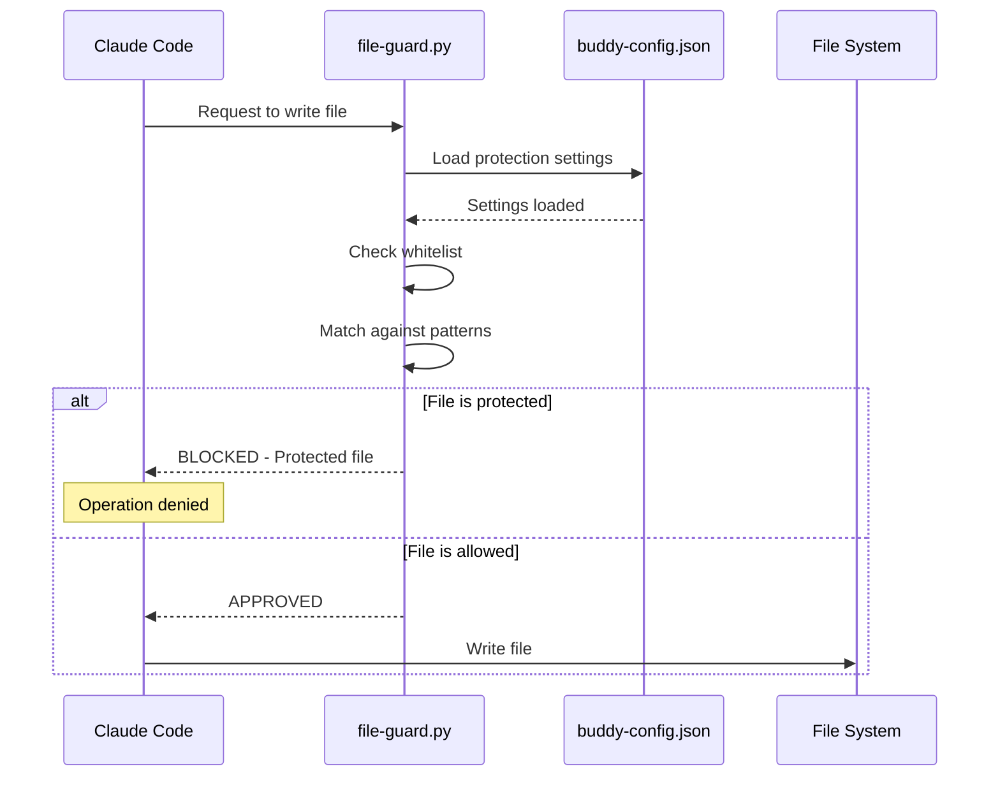
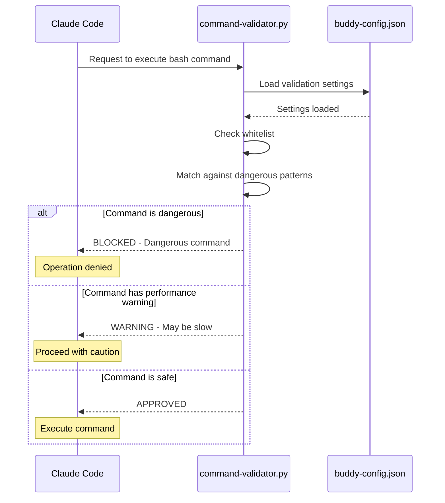

# Authentication & Authorization

Claude Buddy operates entirely within the Claude Code environment and does not have traditional authentication mechanisms. Instead, it uses file system permissions and configuration-based access control.

## Access Model

### Local File System Access
Claude Buddy runs with the same permissions as the user running Claude Code:
- Read access to project files
- Write access controlled by file system permissions
- No network authentication required
- No API keys or tokens needed

## Authorization Mechanisms

### 1. File Protection System

**Purpose**: Prevent unauthorized modification of sensitive files

**Configuration** (`buddy-config.json`):
```json
{
  "file_protection": {
    "enabled": true,
    "additional_patterns": [],
    "whitelist_patterns": [],
    "strict_mode": false
  }
}
```

**Protected Patterns**:
- `.env*` - Environment variables
- `*.key`, `*.pem`, `*.p12` - Cryptographic keys
- `secrets.*`, `credentials.*` - Secret files
- `id_rsa*`, `id_ed25519*` - SSH keys
- `.aws/*`, `.ssh/*` - Credential directories

**Authorization Flow**:


### 2. Command Validation System

**Purpose**: Prevent dangerous command execution

**Configuration**:
```json
{
  "command_validation": {
    "enabled": true,
    "block_dangerous": true,
    "warn_performance": true,
    "suggest_best_practices": true,
    "additional_dangerous_patterns": [],
    "whitelist_patterns": [],
    "strict_mode": false
  }
}
```

**Blocked Commands**:
- `rm -rf /` - Recursive deletion from root
- `sudo rm` - Elevated deletion
- `:(){ :|:& };:` - Fork bomb
- `dd if=.* of=/dev` - Disk operations
- `mkfs.*` - Filesystem formatting
- `chmod -R 777` - Dangerous permissions

**Authorization Flow**:


### 3. Feature Flags

**Purpose**: Control which Claude Buddy features are enabled

**Configuration**:
```json
{
  "features": {
    "auto_commit": true,
    "safety_hooks": true,
    "auto_formatting": true,
    "commit_templates": "conventional",
    "documentation_generation": true,
    "code_review": true,
    "personas": true
  }
}
```

**Access Control Logic**:
```python
# Pseudo-code for feature authorization
def is_feature_enabled(feature_name):
    config = load_buddy_config()
    return config.get("features", {}).get(feature_name, False)

def check_authorization(command):
    if command == "/buddy:persona" and not is_feature_enabled("personas"):
        return "ERROR: Personas feature is disabled"
    if command == "/buddy:docs" and not is_feature_enabled("documentation_generation"):
        return "ERROR: Documentation generation is disabled"
    return "AUTHORIZED"
```

## User Roles (Implicit)

Claude Buddy does not have explicit user roles, but access is determined by:

### 1. Project Member
- **Access**: Full access to all Claude Buddy commands
- **Requirements**: Local clone of project with `.claude-buddy/` directory
- **Capabilities**: Create specs, plans, tasks, documentation, commits

### 2. Configuration Owner
- **Access**: Can modify `buddy-config.json` and `hooks.json`
- **Requirements**: Write access to project files
- **Capabilities**: Enable/disable features, modify protection patterns, configure hooks

### 3. Foundation Maintainer
- **Access**: Can modify `directive/foundation.md`
- **Requirements**: Project governance authority
- **Capabilities**: Update core principles, amend foundation, change governance

## Security Policies

### Protected File Policy
**Default Behavior**: Block all operations on protected files

**Override Mechanism**: Add to whitelist
```json
{
  "file_protection": {
    "whitelist_patterns": [
      "test/fixtures/.env.test"
    ]
  }
}
```

### Command Execution Policy
**Default Behavior**: Block dangerous commands, warn on performance issues

**Override Mechanism**: Add to whitelist
```json
{
  "command_validation": {
    "whitelist_patterns": [
      "rm -rf dist/",
      "sudo apt-get update"
    ]
  }
}
```

### Strict Mode
**Purpose**: Enhanced security for sensitive projects

**Configuration**:
```json
{
  "file_protection": {
    "strict_mode": true
  },
  "command_validation": {
    "strict_mode": true
  }
}
```

**Strict Mode Behavior**:
- **File Protection**: No whitelist overrides allowed
- **Command Validation**: No whitelist overrides allowed
- **Additional Checks**: More aggressive pattern matching
- **Logging**: All blocked operations logged

## Audit and Logging

### Activity Logging
**Configuration**:
```json
{
  "logging": {
    "enabled": true,
    "level": "info",
    "file_operations": true,
    "command_executions": true,
    "hook_activities": true
  }
}
```

**Log Content**:
- Timestamp of operation
- User context (if available)
- Operation type (file write, command execution)
- Authorization decision (approved/blocked)
- Reason for decision

**Example Log Entry**:
```
2025-10-02T17:30:45Z [INFO] file_protection: BLOCKED Write operation on .env - matches protected pattern
2025-10-02T17:31:12Z [INFO] command_validation: APPROVED Bash command "git status"
2025-10-02T17:32:05Z [WARNING] command_validation: WARNED Bash command "find / -name test" - performance concern
```

## Configuration Security

### Configuration File Permissions
Recommended file system permissions:
```bash
chmod 644 .claude-buddy/buddy-config.json
chmod 644 .claude/hooks.json
chmod 600 .env  # If exists
```

### Sensitive Data in Configuration
**Never store** in configuration files:
- API keys or tokens
- Passwords or credentials
- Private keys or certificates

**Instead use**:
- Environment variables
- Secure credential stores
- External secret management (AWS Secrets Manager, HashiCorp Vault)

## Best Practices

### 1. Principle of Least Privilege
- Enable only required features
- Use strict mode in production environments
- Regularly review whitelist entries

### 2. Defense in Depth
- File protection + command validation working together
- Multiple pattern checks (both built-in and custom)
- Timeouts on hook execution

### 3. Transparency
- All authorization decisions logged (if enabled)
- Clear error messages when operations blocked
- Suggestions provided for alternative approaches

### 4. Regular Audits
- Review `buddy-config.json` for unnecessary whitelist entries
- Check logs for repeated blocked operations
- Update protection patterns as needed

## Troubleshooting Authorization Issues

### Operation Blocked Unexpectedly

**Symptom**: Legitimate operation blocked by file protection

**Solution**:
1. Check which pattern matched: review error message
2. Verify file truly not sensitive
3. Add to whitelist if safe:
```json
{
  "file_protection": {
    "whitelist_patterns": [
      "path/to/safe/file"
    ]
  }
}
```

### Command Blocked Unexpectedly

**Symptom**: Safe command blocked by command validation

**Solution**:
1. Review command for dangerous patterns
2. Consider safer alternatives (e.g., `rm -rf dist/` instead of `rm -rf /`)
3. Add to whitelist if truly safe:
```json
{
  "command_validation": {
    "whitelist_patterns": [
      "safe-command-pattern"
    ]
  }
}
```

### Hooks Not Running

**Symptom**: No authorization checks occurring

**Solution**:
1. Check Claude Code settings: `.claude/settings.local.json`
```json
{
  "hooks": {
    "enabled": true
  }
}
```
2. Verify hooks registered: `.claude/hooks.json`
3. Check hook file permissions: `chmod +x .claude/hooks/*.py`
4. Test hook directly: `uv run --no-project python .claude/hooks/file-guard.py`

## Related Documentation

- [Architecture Components](./architecture-components.md) - Safety hook system details
- [Development Setup](./development-setup.md) - Configuration guide
- [Troubleshooting Common Issues](./troubleshooting-common-issues.md) - Authorization problems
