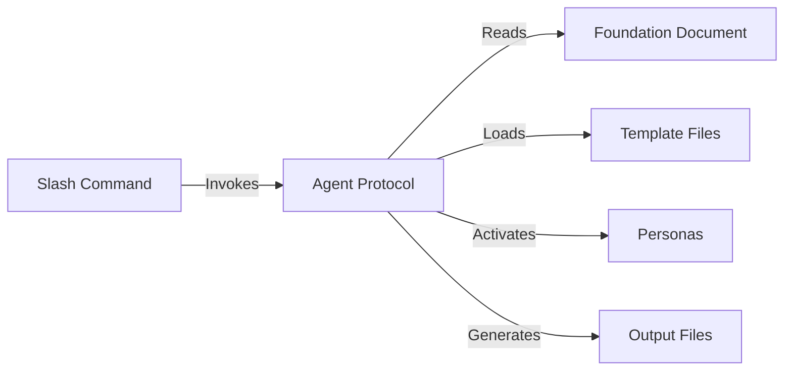
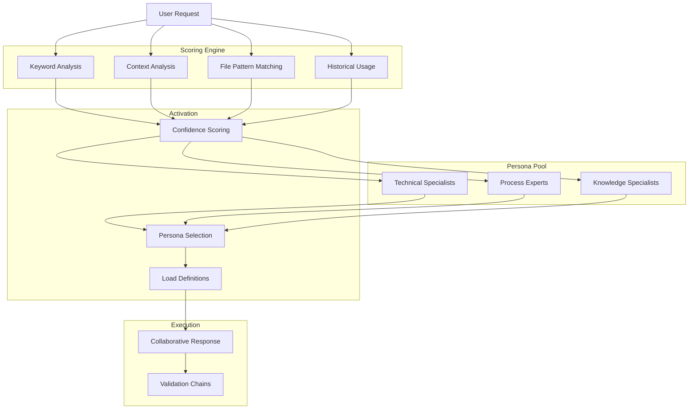
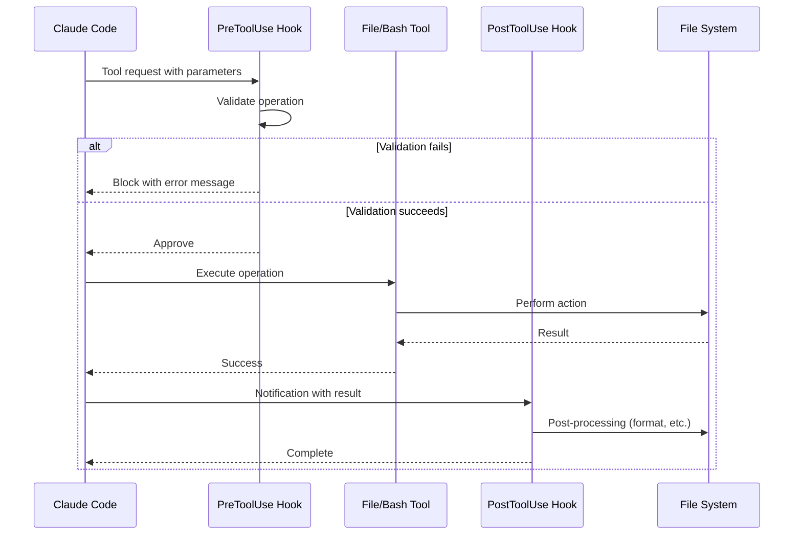

# Architecture Components

This document provides detailed information about each component in the Claude Buddy system.

## Command System

### Overview
Slash commands provide the primary user interface to Claude Buddy functionality. All commands follow the `/buddy:` naming convention for discoverability and consistency.

### Command Structure
```
/buddy:<command-name> [arguments]
```

### Available Commands

#### `/buddy:persona`
**Purpose**: Activate specialized personas based on request context

**Location**: `.claude/commands/buddy/persona.md`

**Modes**:
- **Auto-activation**: System analyzes request and selects appropriate personas
- **Manual selection**: User explicitly specifies personas

**Usage Examples**:
```bash
# Auto-activation
/buddy:persona How should I design a scalable microservices architecture?

# Manual selection
/buddy:persona architect security - review this authentication system
```

**Scoring Algorithm**:
- Keyword matching: 30%
- Context analysis: 40%
- File pattern matching: 20%
- Historical usage: 10%
- Activation threshold: 0.7 confidence score

#### `/buddy:foundation`
**Purpose**: Create or update project foundation document

**Location**: `.claude/commands/buddy/foundation.md`

**Modes**:
- Interactive: Guided question-and-answer flow
- Provided: User supplies foundation overview upfront

**Output**: `directive/foundation.md` with versioning and sync impact report

**Foundation Components**:
- Purpose statement
- Core principles (5 recommended)
- Governance procedures
- Dependent artifacts
- Version metadata

#### `/buddy:spec`
**Purpose**: Generate formal specification from natural language feature description

**Location**: `.claude/commands/buddy/spec.md`

**Input**: Natural language feature request

**Output**: `specs/YYYYMMDD-feature-name/spec.md`

**Content Sections**:
- Feature overview
- Functional requirements
- Non-functional requirements
- Technical constraints
- Acceptance criteria

#### `/buddy:plan`
**Purpose**: Create implementation plan from specification

**Location**: `.claude/commands/buddy/plan.md`

**Prerequisites**: Existing specification document

**Output**: `specs/YYYYMMDD-feature-name/plan.md`

**Content Sections**:
- Implementation strategy
- Architecture decisions
- Component breakdown
- Integration points
- Risk analysis

#### `/buddy:tasks`
**Purpose**: Generate actionable task breakdown from implementation plan

**Location**: `.claude/commands/buddy/tasks.md`

**Prerequisites**: Existing plan document

**Output**: `specs/YYYYMMDD-feature-name/tasks.md`

**Task Structure**:
- Task ID and priority
- Description and acceptance criteria
- Dependencies and blockers
- Estimated effort
- Technical notes

#### `/buddy:docs`
**Purpose**: Generate comprehensive technical documentation

**Location**: `.claude/commands/buddy/docs.md`

**Prerequisites**: Foundation document

**Output**: `docs/` directory with complete documentation set

**Generated Artifacts**: Architecture, API, development guides, deployment, troubleshooting

#### `/buddy:commit`
**Purpose**: Create professional git commits with persona-enhanced analysis

**Location**: `.claude/commands/buddy/commit.md`

**Features**:
- Analyzes staged and unstaged changes
- Follows repository commit style
- Generates conventional commit messages
- Handles pre-commit hook modifications

**Note**: Per project requirements, this command does NOT include Claude attribution in commit messages.

## Agent System

### Overview
Agents implement the core logic for slash commands. Each agent is a specialized protocol loaded by Claude Code when invoked.

### Agent Architecture



### Agent Catalog

#### persona-dispatcher
**File**: `.claude/agents/persona-dispatcher.md` (23KB)

**Responsibilities**:
- Parse user request and extract intent
- Score all available personas based on confidence algorithm
- Select top 1-3 personas (threshold ≥ 0.7)
- Load persona definitions from `.claude-buddy/personas/`
- Merge persona perspectives and generate response
- Handle collaboration patterns between personas

**Scoring Logic**:
```python
# Pseudo-code for persona scoring
def calculate_persona_score(request, persona):
    keyword_score = match_keywords(request, persona.triggers) * 0.3
    context_score = analyze_context(request, persona.specialization) * 0.4
    file_pattern_score = match_files(request, persona.file_patterns) * 0.2
    history_score = get_usage_history(persona) * 0.1
    return keyword_score + context_score + file_pattern_score + history_score
```

**Collaboration Patterns**:
- architect + performance → System design with performance budgets
- security + backend → Secure server-side development
- frontend + qa → User-focused development with testing
- mentor + scribe → Educational content creation

#### foundation
**File**: `.claude/agents/foundation.md` (13KB)

**Responsibilities**:
- Guide user through foundation creation (interactive mode)
- Parse provided foundation overview (provided mode)
- Generate 5 core principles with requirements, rationale, and compliance
- Create governance and versioning sections
- Identify dependent artifacts
- Generate sync impact report
- Version the foundation document

**Versioning Policy**:
- **MAJOR**: Removal or redefinition of principles
- **MINOR**: Addition of principles or material expansions
- **PATCH**: Clarifications and wording improvements

#### spec-writer
**File**: `.claude/agents/spec-writer.md` (8KB)

**Responsibilities**:
- Parse natural language feature request
- Check foundation alignment
- Generate formal specification document
- Define functional and non-functional requirements
- Identify technical constraints
- Create acceptance criteria
- Organize output in `specs/YYYYMMDD-feature-name/` directory

**Specification Template**:
```markdown
# Feature Specification
## Overview
## Functional Requirements
## Non-Functional Requirements
## Technical Constraints
## Acceptance Criteria
## Dependencies
## Risk Analysis
```

#### plan-writer
**File**: `.claude/agents/plan-writer.md` (10KB)

**Responsibilities**:
- Load and analyze existing specification
- Check foundation alignment
- Define implementation strategy
- Make architecture decisions
- Break down components
- Identify integration points
- Analyze risks and mitigation strategies

**Output Structure**:
```markdown
# Implementation Plan
## Strategy
## Architecture Decisions
## Component Breakdown
## Integration Points
## Risk Analysis
## Timeline Estimates
```

#### tasks-writer
**File**: `.claude/agents/tasks-writer.md` (11KB)

**Responsibilities**:
- Load specification and plan documents
- Break down plan into actionable tasks
- Assign priorities and dependencies
- Estimate effort for each task
- Create task sequence and grouping
- Generate technical implementation notes

**Task Format**:
```markdown
### [TASK-001] Task Title
**Priority**: High | Medium | Low
**Description**: Clear task description
**Acceptance Criteria**: Definition of done
**Dependencies**: List of blocking tasks
**Estimated Effort**: Hours or story points
**Notes**: Technical implementation details
```

#### docs-generator
**File**: `.claude/agents/docs-generator.md` (14KB)

**Responsibilities**:
- Verify foundation document exists
- Load foundation-specific template
- Execute codebase analysis commands
- Generate comprehensive documentation set
- Create mermaid diagrams
- Include code examples from codebase
- Validate all documentation for correctness

**Documentation Set** (19 files):
- Architecture: overview, components, data-flow, technology-stack
- API: authentication, endpoints, schemas, examples
- Development: setup, coding-standards, testing, debugging
- Deployment: prerequisites, configuration, deployment, monitoring
- Troubleshooting: common-issues, performance, faq

#### git-workflow
**File**: `.claude/agents/git-workflow.md` (15KB)

**Responsibilities**:
- Execute git operations safely
- Generate commit messages following repository style
- Handle pre-commit hook modifications
- Create pull requests with comprehensive descriptions
- Ensure proper authorship preservation
- Never skip hooks or force operations

**Commit Message Strategy**:
1. Run git status, git diff, git log in parallel
2. Analyze all changes (not just latest commit)
3. Draft commit message focusing on "why" not "what"
4. Per project requirements: NO Claude attribution
5. Use heredoc for proper formatting

## Persona System

### Overview
The persona system provides specialized domain expertise through configurable AI personalities. Each persona has defined expertise, triggers, and collaboration patterns.

### Persona Architecture



### Persona Catalog

#### Technical Specialists

**architect** (6KB)
- Systems design and long-term architecture
- Scalability, modularity, maintainability focus
- High confidence triggers: "architecture", "design", "scalability", "system"

**frontend** (7KB)
- UI/UX specialist and accessibility advocate
- React, Vue, Angular expertise
- Triggers: "UI", "component", "accessibility", "responsive"

**backend** (8KB)
- Reliability engineer and API specialist
- REST, GraphQL, database optimization
- Triggers: "API", "endpoint", "database", "server"

**security** (9KB)
- Threat modeler and vulnerability specialist
- Authentication, authorization, encryption
- Triggers: "security", "auth", "vulnerability", "encryption"

**performance** (10KB)
- Optimization specialist and bottleneck elimination
- Profiling, caching, query optimization
- Triggers: "performance", "slow", "optimize", "bottleneck"

#### Process Experts

**analyzer** (10KB)
- Root cause specialist and systematic investigator
- Debugging, tracing, hypothesis testing
- Triggers: "debug", "issue", "problem", "investigate"

**qa** (11KB)
- Quality advocate and testing specialist
- Unit, integration, e2e testing strategies
- Triggers: "test", "quality", "bug", "coverage"

**refactorer** (11KB)
- Code quality specialist and technical debt manager
- Clean code, design patterns, SOLID principles
- Triggers: "refactor", "clean", "debt", "improve"

**devops** (11KB)
- Infrastructure specialist and deployment expert
- CI/CD, Docker, Kubernetes, monitoring
- Triggers: "deploy", "ci/cd", "docker", "infrastructure"

**po** (7KB)
- Product requirement specialist and strategic planner
- User stories, acceptance criteria, backlog management
- Triggers: "requirements", "user story", "feature", "backlog"

#### Knowledge Specialists

**mentor** (11KB)
- Knowledge transfer specialist and educator
- Teaching, onboarding, documentation
- Triggers: "learn", "explain", "teach", "how to"

**scribe** (11KB)
- Professional writer and documentation specialist
- Technical writing, style guides, content strategy
- Triggers: "document", "write", "readme", "guide"

### Persona Configuration

Each persona definition includes:

```markdown
# Persona Name - Brief Description

## Identity & Expertise
- Role, priority hierarchy, specializations

## Core Principles
- Guiding principles (numbered list)

## Auto-Activation Triggers
- High confidence (95%+): Primary keywords
- Medium confidence (80-94%): Secondary keywords
- Context clues: File patterns and project indicators

## Collaboration Patterns
- Primary collaborations with other personas
- Leadership areas and decision-making authority

## Response Patterns
- Structured approach to handling requests
- Communication style and delivery preferences

## Command Specializations
- Expertise in specific /buddy: commands
```

### Session Memory
When enabled (`buddy-config.json`), personas maintain:
- Context continuity across interactions
- Learning from feedback
- Adaptation to user preferences
- Historical usage patterns

## Safety Hook System

### Overview
Python-based hooks provide multiple layers of protection against destructive operations. Hooks execute at PreToolUse and PostToolUse phases.

### Hook Architecture



### Hook Catalog

#### file-guard.py
**File**: `.claude/hooks/file-guard.py` (8KB)

**Purpose**: Protect sensitive files from modification

**Matchers**: Write, Edit, MultiEdit tools

**Protected Patterns**:
```python
SENSITIVE_FILE_PATTERNS = [
    r"\.env.*",
    r".*\.key$",
    r".*\.pem$",
    r"secrets?\..*",
    r"credentials?\..*",
    r"id_rsa.*",
    r"\.aws/.*",
    r"\.ssh/.*",
    # ... additional patterns
]
```

**Configuration** (`buddy-config.json`):
```json
{
  "file_protection": {
    "enabled": true,
    "additional_patterns": [],
    "whitelist_patterns": [],
    "strict_mode": false
  }
}
```

**Behavior**:
- Blocks operations on matching files
- Returns clear error message with reason
- Logs protection events (if enabled)
- Respects whitelist for approved overrides

#### command-validator.py
**File**: `.claude/hooks/command-validator.py` (11KB)

**Purpose**: Block dangerous shell commands

**Matcher**: Bash tool

**Dangerous Patterns**:
```python
DANGEROUS_COMMANDS = [
    r"rm\s+-rf\s+/",
    r"sudo\s+rm",
    r":(){ :|:& };:",  # Fork bomb
    r"dd\s+if=.*of=/dev/",
    r"mkfs\.",
    r"chmod\s+-R\s+777",
    # ... additional patterns
]
```

**Warning Patterns** (performance):
```python
PERFORMANCE_WARNINGS = [
    r"find\s+/\s+",
    r"grep\s+-r\s+/",
    r"chmod\s+-R",
    # ... additional patterns
]
```

**Configuration**:
```json
{
  "command_validation": {
    "enabled": true,
    "block_dangerous": true,
    "warn_performance": true,
    "suggest_best_practices": true,
    "additional_dangerous_patterns": [],
    "whitelist_patterns": [],
    "strict_mode": false
  }
}
```

#### auto-formatter.py
**File**: `.claude/hooks/auto-formatter.py` (12KB)

**Purpose**: Automatically format code files after modification

**Matchers**: Write, Edit, MultiEdit tools (PostToolUse)

**Supported Extensions**:
```json
[".py", ".js", ".ts", ".tsx", ".jsx", ".json", ".css", ".scss", ".md"]
```

**Formatters**:
- **Python**: black (if available)
- **JavaScript/TypeScript**: prettier (if available)
- **JSON**: built-in json.tool
- **Markdown**: basic formatting

**Configuration**:
```json
{
  "auto_formatting": {
    "enabled": true,
    "extensions": [...],
    "tools": {},
    "exclude_patterns": ["node_modules/", ".git/", "dist/"],
    "create_backup": false
  }
}
```

**Behavior**:
- Runs after successful file modification
- Only formats if formatter tool is available
- Respects exclude patterns
- Timeout: 30 seconds
- Returns formatted content or original on failure

### Hook Registration

Hooks are registered in `.claude/hooks.json`:

```json
{
  "hooks": {
    "PreToolUse": [
      {
        "matcher": "Write",
        "hooks": [
          {
            "type": "command",
            "command": "uv run --no-project python .claude/hooks/file-guard.py",
            "description": "Protect sensitive files",
            "enabled": true,
            "timeout": 10
          }
        ]
      }
    ],
    "PostToolUse": [
      {
        "matcher": "Write",
        "hooks": [
          {
            "type": "command",
            "command": "uv run --no-project python .claude/hooks/auto-formatter.py",
            "description": "Auto-format code files",
            "enabled": true,
            "timeout": 30
          }
        ]
      }
    ]
  }
}
```

### Hook Communication Protocol

Hooks use stdin/stdout JSON protocol:

**Input** (stdin):
```json
{
  "tool": "Write",
  "parameters": {
    "file_path": "/path/to/file.py",
    "content": "# Python code..."
  }
}
```

**Output** (stdout):
```json
{
  "approved": true,
  "message": "Operation approved"
}
```

**Error** (blocking):
```json
{
  "approved": false,
  "message": "Operation blocked: File matches protected pattern .env",
  "suggestion": "Consider using .env.example for template files"
}
```

## Template System

### Overview
Foundation-specific templates drive document generation for different technology stacks. Templates define structure, analysis commands, and content patterns.

### Template Structure

```
.claude-buddy/templates/
├── default/
│   ├── spec.md
│   ├── plan.md
│   ├── tasks.md
│   └── docs.md
├── jhipster/
│   ├── spec.md
│   ├── plan.md
│   ├── tasks.md
│   └── docs.md
└── mulesoft/
    ├── spec.md
    ├── plan.md
    ├── tasks.md
    └── docs.md
```

### Template Components

Each template includes:

1. **Agent Role Definition** - Purpose and scope
2. **Content Structure** - Output organization
3. **Analysis Process** - Commands to execute
4. **Content Generation Strategy** - Patterns and examples
5. **Quality Assurance** - Validation checklist
6. **Output Delivery** - File creation instructions

### Foundation-Specific Adaptations

**default**: Generic software projects
- Technology-agnostic patterns
- Universal documentation structure
- Common development workflows

**jhipster**: JHipster full-stack applications
- Spring Boot + Angular/React patterns
- Microservices architecture
- JDL schema integration
- Liquibase migrations

**mulesoft**: MuleSoft integration projects
- DataWeave transformations
- Anypoint Platform integration
- RAML/OAS specifications
- Connector development

## Configuration System

### buddy-config.json

Central configuration file for all Claude Buddy features:

```json
{
  "version": "1.0.0",
  "mode": "project",
  "features": {
    "auto_commit": true,
    "safety_hooks": true,
    "auto_formatting": true,
    "personas": true
  },
  "personas": {
    "enabled": true,
    "auto_activation": {
      "enabled": true,
      "confidence_threshold": 0.7,
      "max_active_personas": 3
    }
  }
}
```

### hooks.json

Hook registration and configuration:

```json
{
  "hooks": {
    "PreToolUse": [...],
    "PostToolUse": [...]
  }
}
```

### settings.local.json

Claude Code settings (user-specific):

```json
{
  "hooks": {
    "enabled": true
  }
}
```

## Related Documentation

- [Architecture Overview](./architecture-overview.md) - High-level system design
- [Data Flow](./architecture-data-flow.md) - Information flow through system
- [Technology Stack](./architecture-technology-stack.md) - Technology deep dive
