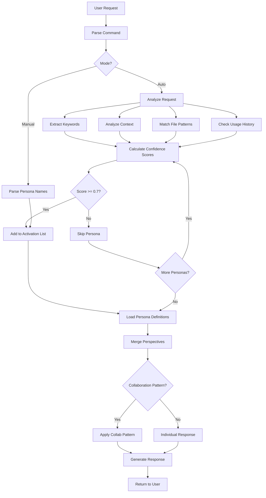
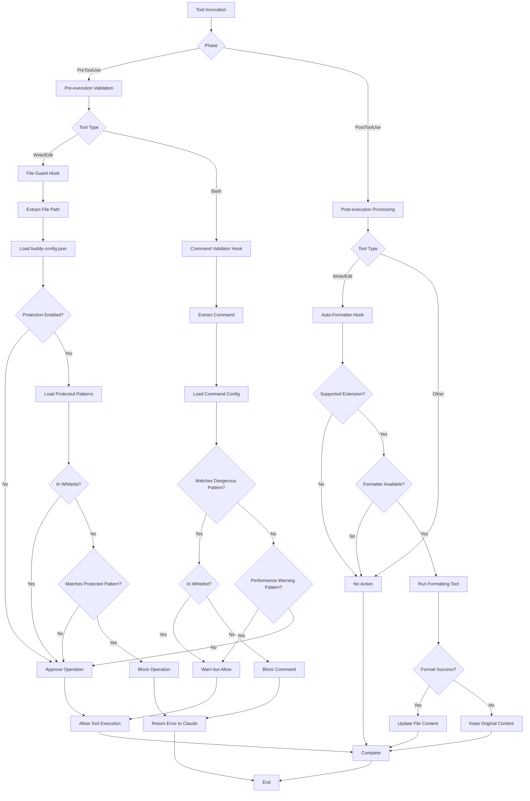
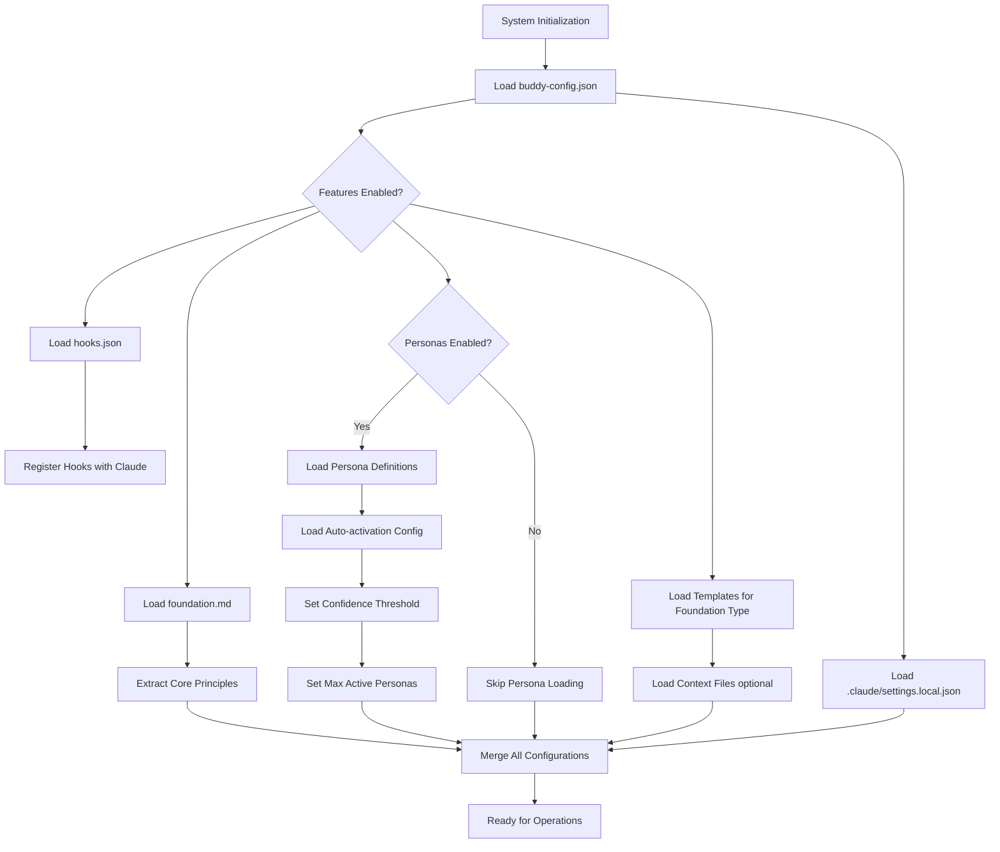
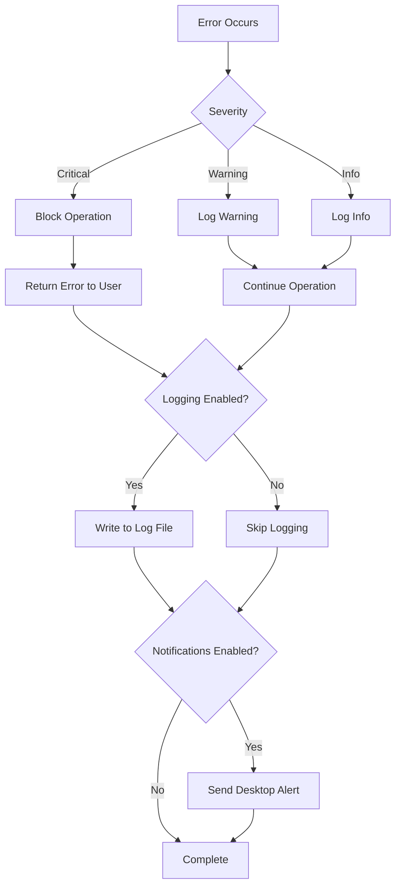

# Data Flow Analysis

This document provides a detailed analysis of how data flows through the Claude Buddy system across different operational scenarios.

## Overview

Claude Buddy processes data through multiple interconnected layers:
1. **Input Layer** - User commands and requests
2. **Analysis Layer** - Request parsing and context loading
3. **Execution Layer** - Content generation and file operations
4. **Validation Layer** - Safety hooks and quality checks
5. **Output Layer** - Generated artifacts and logs

## Primary Data Flows

### 1. Persona Activation Flow



**Data Elements**:
- **Input**: User request string, explicit persona names (optional)
- **Intermediate**: Keyword list, context map, file pattern matches, confidence scores
- **Output**: Activated persona list, merged persona perspectives, final response

**Scoring Formula**:
```
final_score = (keyword_match * 0.3) +
              (context_match * 0.4) +
              (file_pattern_match * 0.2) +
              (usage_history * 0.1)
```

### 2. Foundation Creation Flow

```mermaid
flowchart TD
    Start[/buddy:foundation] --> CheckExisting{Foundation Exists?}

    CheckExisting -->|Yes| ConfirmUpdate{User Confirms Update?}
    CheckExisting -->|No| DetermineMode[Determine Mode]

    ConfirmUpdate -->|No| Abort[Abort Operation]
    ConfirmUpdate -->|Yes| DetermineMode

    DetermineMode --> ModeChoice{Mode}

    ModeChoice -->|Interactive| AskQuestions[Ask Guided Questions]
    ModeChoice -->|Provided| ParseOverview[Parse Provided Overview]

    AskQuestions --> CollectAnswers[Collect User Answers]
    CollectAnswers --> AnalyzeAnswers[Analyze Project Context]

    ParseOverview --> AnalyzeAnswers

    AnalyzeAnswers --> GeneratePurpose[Generate Purpose Statement]
    GeneratePurpose --> DerivePrinciples[Derive Core Principles]
    DerivePrinciples --> AddRequirements[Add Requirements to Each]
    AddRequirements --> AddRationale[Add Rationale to Each]
    AddRationale --> AddCompliance[Add Compliance Verification]

    AddCompliance --> CreateGovernance[Create Governance Section]
    CreateGovernance --> IdentifyArtifacts[Identify Dependent Artifacts]
    IdentifyArtifacts --> SetMetadata[Set Foundation Metadata]

    SetMetadata --> GenerateSyncReport[Generate Sync Impact Report]
    GenerateSyncReport --> WriteFoundation[Write foundation.md]

    WriteFoundation --> CreateDirIfNeeded{directive/ exists?}
    CreateDirIfNeeded -->|No| CreateDir[Create directive/]
    CreateDirIfNeeded -->|Yes| SaveFile[Save File]
    CreateDir --> SaveFile

    SaveFile --> End[Report Success]
    Abort --> End
```

**Data Elements**:
- **Input**: User overview or guided answers
- **Intermediate**: Purpose statement, principle drafts, requirements, rationale, compliance checks
- **Output**: Foundation document with sync report

**Foundation Document Structure**:
```markdown
# Project Foundation
## Purpose
## Core Principles (5)
  ### Principle N: Title
  **Requirements**: ...
  **Rationale**: ...
  **Compliance Verification**: ...
## Governance
## Dependent Artifacts
## Foundation Metadata
## Review History
```

### 3. Document Generation Flow

```mermaid
flowchart TD
    Start[/buddy:docs] --> CheckFoundation{foundation.md exists?}

    CheckFoundation -->|No| Error[Error: Run /buddy:foundation first]
    CheckFoundation -->|Yes| LoadFoundation[Load Foundation Document]

    LoadFoundation --> ExtractType[Extract Foundation Type]
    ExtractType --> LoadTemplate[Load Template for Type]

    LoadTemplate --> CheckTemplate{Template exists?}
    CheckTemplate -->|No| ErrorTemplate[Error: Template not found]
    CheckTemplate -->|Yes| LoadContext[Load Context Files optional]

    LoadContext --> LoadScribe[Load Scribe Persona]
    LoadScribe --> ExecuteAnalysis[Execute Analysis Commands]

    ExecuteAnalysis --> DetectTech[Detect Technology Stack]
    DetectTech --> AnalyzeStructure[Analyze Codebase Structure]
    AnalyzeStructure --> ExtractAPIs[Extract API Definitions]
    ExtractAPIs --> FindConfig[Find Configuration Files]
    FindConfig --> FindTests[Find Test Files]

    FindTests --> CheckDocsDir{docs/ exists?}
    CheckDocsDir -->|Yes| AskOverwrite{Overwrite?}
    CheckDocsDir -->|No| CreateDocsDir[Create docs/]

    AskOverwrite -->|No| Abort[Abort Operation]
    AskOverwrite -->|Yes| CreateDocsDir

    CreateDocsDir --> GenArchitecture[Generate Architecture Docs]
    GenArchitecture --> GenAPI[Generate API Docs]
    GenAPI --> GenDevelopment[Generate Development Guides]
    GenDevelopment --> GenDeployment[Generate Deployment Docs]
    GenDeployment --> GenTroubleshooting[Generate Troubleshooting Guides]

    GenTroubleshooting --> CreateIndex[Create docs/README.md]
    CreateIndex --> ValidateDocs[Validate All Docs]

    ValidateDocs --> CheckMarkdown[Check Markdown Syntax]
    CheckMarkdown --> ValidateDiagrams[Validate Mermaid Diagrams]
    ValidateDiagrams --> CheckLinks[Check Internal Links]
    CheckLinks --> ValidateCode[Validate Code Examples]

    ValidateCode --> GenerateReport[Generate Completion Report]
    GenerateReport --> End[Return Report to User]

    Error --> End
    ErrorTemplate --> End
    Abort --> End
```

**Data Elements**:
- **Input**: Foundation document, template, context files (optional)
- **Intermediate**: Technology stack info, file structure, API definitions, configurations
- **Output**: 19+ markdown documentation files with diagrams and examples

**Documentation File Tree**:
```
docs/
├── README.md (navigation index)
├── architecture-overview.md
├── architecture-components.md
├── architecture-data-flow.md
├── architecture-technology-stack.md
├── api-authentication.md
├── api-endpoints.md
├── api-schemas.md
├── api-examples.md
├── development-setup.md
├── development-coding-standards.md
├── development-testing.md
├── development-debugging.md
├── deployment-prerequisites.md
├── deployment-configuration.md
├── deployment-deployment.md
├── deployment-monitoring.md
├── troubleshooting-common-issues.md
├── troubleshooting-performance.md
└── troubleshooting-faq.md
```

### 4. Safety Hook Validation Flow



**Hook Communication**:

**Request** (Claude → Hook):
```json
{
  "tool": "Write",
  "parameters": {
    "file_path": "/path/to/.env",
    "content": "SECRET_KEY=xyz"
  }
}
```

**Response** (Hook → Claude):
```json
{
  "approved": false,
  "message": "Operation blocked: File matches protected pattern .env",
  "suggestion": "Use .env.example for template files",
  "details": {
    "pattern": "\\.env.*",
    "severity": "high"
  }
}
```

### 5. Spec → Plan → Tasks Flow

```mermaid
flowchart TD
    Start[User Feature Request] --> SpecCmd[/buddy:spec]

    SpecCmd --> ParseRequest[Parse Natural Language Request]
    ParseRequest --> LoadFoundation1[Load Foundation]
    LoadFoundation1 --> LoadSpecTemplate[Load Spec Template]

    LoadSpecTemplate --> GenerateSpec[Generate Specification]
    GenerateSpec --> DefineRequirements[Define Functional/Non-functional Reqs]
    DefineRequirements --> IdentifyConstraints[Identify Technical Constraints]
    IdentifyConstraints --> CreateAcceptance[Create Acceptance Criteria]

    CreateAcceptance --> CreateSpecDir[Create specs/YYYYMMDD-name/]
    CreateSpecDir --> WriteSpec[Write spec.md]
    WriteSpec --> SpecComplete[Specification Complete]

    SpecComplete --> PlanCmd[/buddy:plan]

    PlanCmd --> LoadSpec[Load spec.md]
    LoadSpec --> LoadFoundation2[Load Foundation]
    LoadFoundation2 --> LoadPlanTemplate[Load Plan Template]

    LoadPlanTemplate --> AnalyzeSpec[Analyze Specification]
    AnalyzeSpec --> DefineStrategy[Define Implementation Strategy]
    DefineStrategy --> MakeArchDecisions[Make Architecture Decisions]
    MakeArchDecisions --> BreakdownComponents[Breakdown Components]
    BreakdownComponents --> IdentifyIntegrations[Identify Integration Points]
    IdentifyIntegrations --> AnalyzeRisks[Analyze Risks]

    AnalyzeRisks --> WritePlan[Write plan.md]
    WritePlan --> PlanComplete[Plan Complete]

    PlanComplete --> TasksCmd[/buddy:tasks]

    TasksCmd --> LoadPlan[Load plan.md]
    LoadPlan --> LoadSpecAgain[Load spec.md]
    LoadSpecAgain --> LoadFoundation3[Load Foundation]
    LoadFoundation3 --> LoadTasksTemplate[Load Tasks Template]

    LoadTasksTemplate --> AnalyzePlan[Analyze Plan]
    AnalyzePlan --> BreakdownTasks[Breakdown into Tasks]
    BreakdownTasks --> AssignPriorities[Assign Priorities]
    AssignPriorities --> IdentifyDeps[Identify Dependencies]
    IdentifyDeps --> EstimateEffort[Estimate Effort]
    EstimateEffort --> SequenceTasks[Sequence Tasks]

    SequenceTasks --> WriteTasks[Write tasks.md]
    WriteTasks --> End[Tasks Complete]
```

**Data Transformation**:

**Stage 1 - Natural Language to Specification**:
```
Input: "Add user authentication with OAuth2"
Output: Structured specification with:
  - Functional requirements (login, logout, token refresh)
  - Non-functional requirements (security, performance)
  - Technical constraints (OAuth2 provider compatibility)
  - Acceptance criteria (testable conditions)
```

**Stage 2 - Specification to Implementation Plan**:
```
Input: Specification document
Output: Implementation plan with:
  - Strategy (OAuth2 authorization code flow)
  - Architecture decisions (library selection, token storage)
  - Component breakdown (auth controller, middleware, token service)
  - Integration points (frontend, database, OAuth2 provider)
  - Risk analysis (security vulnerabilities, vendor lock-in)
```

**Stage 3 - Plan to Actionable Tasks**:
```
Input: Implementation plan
Output: Task list with:
  - [TASK-001] Setup OAuth2 library (Priority: High, 2h)
  - [TASK-002] Implement auth controller (Priority: High, 4h, Depends: TASK-001)
  - [TASK-003] Create token service (Priority: High, 3h, Depends: TASK-001)
  - [TASK-004] Add auth middleware (Priority: Medium, 2h, Depends: TASK-003)
  - ...
```

### 6. Task Implementation Flow

```mermaid
flowchart TD
    Start[/buddy:implement] --> DiscoverTasks[Scan specs/ for tasks.md]

    DiscoverTasks --> CheckFound{Tasks Found?}
    CheckFound -->|No| Error1[Error: No tasks found]
    CheckFound -->|Multiple| AskUser[List Options & Ask User]
    CheckFound -->|One| LoadTaskDoc[Load tasks.md]

    AskUser --> LoadTaskDoc

    LoadTaskDoc --> CheckFoundation{foundation.md exists?}
    CheckFoundation -->|No| Error2[Error: Run /buddy:foundation]
    CheckFoundation -->|Yes| LoadFoundation[Load Foundation]

    LoadFoundation --> LoadAllDocs[Load ALL Feature Documents]

    LoadAllDocs --> LoadRequired[Load spec.md, plan.md, tasks.md]
    LoadAllDocs --> LoadOptional[Load data-model.md, contracts/, research.md, etc.]

    LoadRequired --> ParseTasks[Parse Task Structure]
    LoadOptional --> ParseTasks

    ParseTasks --> ExtractPhases[Extract Phases: Setup, Tests, Core, Integration, Polish]
    ExtractPhases --> IdentifyDeps[Identify Dependencies & Parallel Tasks]
    IdentifyDeps --> BuildExecPlan[Build Execution Plan]

    BuildExecPlan --> Phase1[Phase 3.1: Setup]
    Phase1 --> SetupTasks[Execute Setup Tasks]
    SetupTasks --> UpdateTasksMd1[Update tasks.md with [X]]
    UpdateTasksMd1 --> CheckPhase1{All Setup Complete?}

    CheckPhase1 -->|No| Error3[Halt: Setup Failed]
    CheckPhase1 -->|Yes| Phase2[Phase 3.2: Tests TDD Red]

    Phase2 --> WriteTests[Write Failing Tests]
    WriteTests --> UpdateTasksMd2[Update tasks.md with [X]]
    UpdateTasksMd2 --> CheckPhase2{All Tests Written?}

    CheckPhase2 -->|No| Error4[Halt: Test Creation Failed]
    CheckPhase2 -->|Yes| Phase3[Phase 3.3: Core TDD Green]

    Phase3 --> ImplementCore[Implement Features to Pass Tests]
    ImplementCore --> UpdateTasksMd3[Update tasks.md with [X]]
    UpdateTasksMd3 --> CheckPhase3{All Core Complete?}

    CheckPhase3 -->|No| Error5[Halt: Implementation Failed]
    CheckPhase3 -->|Yes| Phase4[Phase 3.4: Integration]

    Phase4 --> IntegrateSystems[Connect Components & Services]
    IntegrateSystems --> UpdateTasksMd4[Update tasks.md with [X]]
    UpdateTasksMd4 --> CheckPhase4{All Integration Complete?}

    CheckPhase4 -->|No| Error6[Halt: Integration Failed]
    CheckPhase4 -->|Yes| Phase5[Phase 3.5: Polish]

    Phase5 --> PolishCode[Optimize, Refactor, Document]
    PolishCode --> UpdateTasksMd5[Update tasks.md with [X]]
    UpdateTasksMd5 --> CheckPhase5{All Polish Complete?}

    CheckPhase5 -->|No| Error7[Halt: Polish Failed]
    CheckPhase5 -->|Yes| ValidateImpl[Validate Implementation]

    ValidateImpl --> RunTests[Run Test Suite]
    RunTests --> TestsPass{Tests Pass?}
    TestsPass -->|No| ReportFailure[Report Test Failures]
    TestsPass -->|Yes| VerifySpec[Verify Matches Spec]

    VerifySpec --> SpecMatch{Matches Requirements?}
    SpecMatch -->|No| ReportGaps[Report Implementation Gaps]
    SpecMatch -->|Yes| UpdateStatus[Update tasks.md Status to Completed]

    UpdateStatus --> ReportSuccess[Report Success Summary]

    Error1 --> End[End]
    Error2 --> End
    Error3 --> End
    Error4 --> End
    Error5 --> End
    Error6 --> End
    Error7 --> End
    ReportFailure --> End
    ReportGaps --> End
    ReportSuccess --> End
```

**Data Transformation - Tasks to Implementation**:

**Input (tasks.md)**:
```markdown
## Phase 3.2: Tests (TDD Red Phase)
- [ ] [TASK-005] Write user model unit tests
- [ ] [TASK-006] Write auth controller integration tests

## Phase 3.3: Core Implementation (TDD Green Phase)
- [ ] [TASK-007] Implement User model with bcrypt
- [ ] [TASK-008] Implement auth controller endpoints
```

**Execution Process**:
1. **Phase 3.2 Execution**: Write tests that fail (red phase)
2. **Update Progress**: `- [X] [TASK-005] Write user model unit tests`
3. **Phase 3.3 Execution**: Implement code to make tests pass (green phase)
4. **Update Progress**: `- [X] [TASK-007] Implement User model with bcrypt`

**Output (tasks.md after execution)**:
```markdown
## Phase 3.2: Tests (TDD Red Phase)
- [X] [TASK-005] Write user model unit tests
- [X] [TASK-006] Write auth controller integration tests

## Phase 3.3: Core Implementation (TDD Green Phase)
- [X] [TASK-007] Implement User model with bcrypt
- [X] [TASK-008] Implement auth controller endpoints

**Status**: Completed
**Tests**: 24/24 passing
**Implementation**: Matches specification requirements
```

### 7. Git Commit Flow

```mermaid
flowchart TD
    Start[/buddy:commit] --> ParallelCheck[Run git status, diff, log]

    ParallelCheck --> AnalyzeStatus[Analyze Untracked Files]
    ParallelCheck --> AnalyzeDiff[Analyze Staged/Unstaged Changes]
    ParallelCheck --> AnalyzeLog[Analyze Commit History]

    AnalyzeStatus --> MergeAnalysis[Merge Analysis Results]
    AnalyzeDiff --> MergeAnalysis
    AnalyzeLog --> MergeAnalysis

    MergeAnalysis --> CheckChanges{Changes to Commit?}
    CheckChanges -->|No| Abort[Abort: No changes]
    CheckChanges -->|Yes| AnalyzeNature[Analyze Change Nature]

    AnalyzeNature --> DetermineType[Determine Commit Type]
    DetermineType --> DraftMessage[Draft Commit Message]

    DraftMessage --> CheckSecrets{Contains Secrets?}
    CheckSecrets -->|Yes| WarnUser[Warn User: Don't Commit Secrets]
    CheckSecrets -->|No| PrepareStaging[Add Relevant Files to Staging]

    WarnUser --> UserConfirm{User Confirms?}
    UserConfirm -->|No| Abort
    UserConfirm -->|Yes| PrepareStaging

    PrepareStaging --> CreateCommit[Create Commit with Message]

    Note1[Note: Per project requirements<br/>NO Claude attribution in message]
    CreateCommit -.-> Note1

    CreateCommit --> CommitSuccess{Commit Success?}
    CommitSuccess -->|No| RetryOnce{Pre-commit Hook Modified Files?}
    CommitSuccess -->|Yes| CheckModified{Files Modified by Hook?}

    RetryOnce -->|Yes| CheckAuthorship[Check Authorship]
    RetryOnce -->|No| ErrorReport[Report Error]

    CheckAuthorship --> IsSafeAmend{Safe to Amend?}
    IsSafeAmend -->|Yes| AmendCommit[Amend Commit]
    IsSafeAmend -->|No| NewCommit[Create New Commit]

    CheckModified -->|Yes| CheckAuthorship
    CheckModified -->|No| Complete[Report Success]

    AmendCommit --> Complete
    NewCommit --> Complete
    ErrorReport --> End[End]
    Complete --> End
    Abort --> End
```

**Commit Message Format** (per project requirements):
```
<type>: <subject>

<body>

<footer - NO Claude attribution per requirements>
```

Example:
```
feat: add user authentication system

- Implement OAuth2 authorization code flow
- Add login, logout, and token refresh endpoints
- Include middleware for protected routes
- Add comprehensive test coverage
```

## Configuration Data Flow

### Configuration Loading Hierarchy



### Configuration Precedence

1. **User-specific settings** (`.claude/settings.local.json`)
2. **Project configuration** (`buddy-config.json`)
3. **Hook configuration** (`hooks.json`)
4. **Foundation principles** (`foundation.md`)
5. **Default values** (hardcoded fallbacks)

## Error Handling and Logging

### Error Data Flow



### Logging Configuration

```json
{
  "logging": {
    "enabled": true,
    "level": "info",
    "file_operations": true,
    "command_executions": true,
    "hook_activities": true
  }
}
```

**Log Levels**:
- **debug**: Detailed diagnostic information
- **info**: General informational messages
- **warning**: Warning messages for non-critical issues
- **error**: Error messages for operation failures
- **critical**: Critical errors requiring immediate attention

## Performance Considerations

### Optimization Points

1. **Persona Loading**: Personas loaded only when activated, not upfront
2. **Template Caching**: Templates cached after first load
3. **Hook Timeouts**: Strict timeouts prevent hanging operations
4. **Parallel Analysis**: Multiple git/analysis commands run in parallel
5. **Lazy Context Loading**: Context files loaded only when needed

### Data Size Constraints

- **Foundation document**: Recommended < 50KB
- **Persona definitions**: Target 5-15KB each
- **Templates**: Target 15-30KB each
- **Hook execution**: Must complete within timeout (10-30s)
- **Commit messages**: Keep concise (< 500 characters subject + body)

## Related Documentation

- [Architecture Overview](./architecture-overview.md) - High-level system design
- [Architecture Components](./architecture-components.md) - Component details
- [Technology Stack](./architecture-technology-stack.md) - Technology choices
