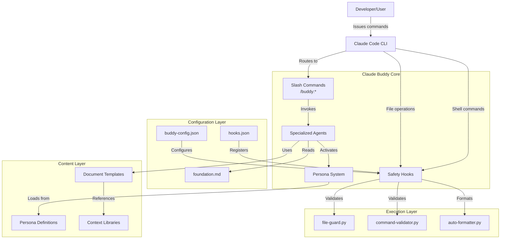
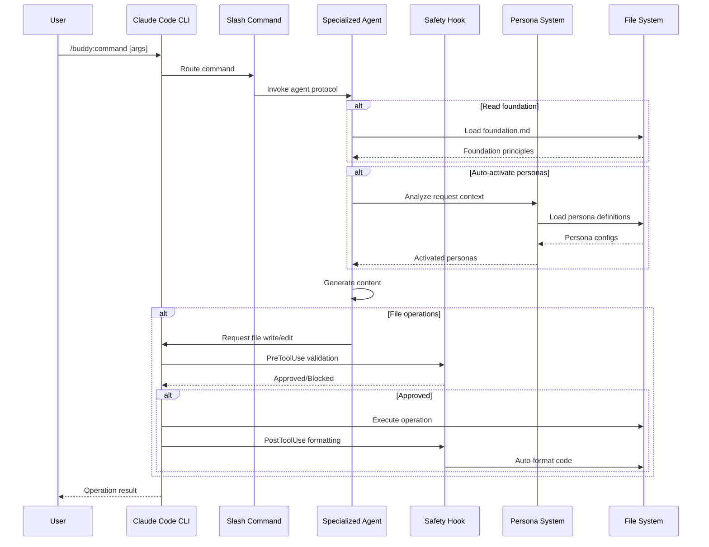
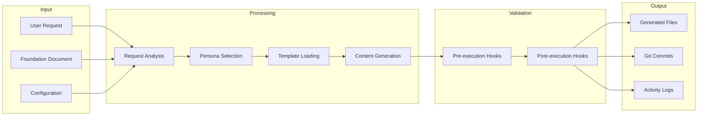

# Architecture Overview

Claude Buddy is an AI assistant configuration framework that enhances Claude Code with specialized personas, automated workflows, and intelligent context management. The system provides a comprehensive ecosystem for developers to leverage domain-specific AI expertise through configurable personas, Python-based safety hooks, and template-driven document generation.

## System Architecture

## High-Level Design Principles

Claude Buddy follows five core principles established in the foundation document:

### 1. Modular Extensibility
The system is designed as a collection of modular, pluggable components that can be independently configured, extended, or replaced without affecting the core framework. All personas, hooks, templates, and commands follow standardized interfaces.

### 2. Safety-First Automation
All automated operations prioritize safety through multiple validation layers, with explicit protections against destructive actions and clear user consent mechanisms. Python-based hooks validate file modifications and command executions before they occur.

### 3. Contextual Intelligence
The system leverages contextual understanding through foundation documents, project templates, and session memory to provide relevant and consistent AI assistance. Auto-activation uses confidence scoring to select appropriate personas.

### 4. Developer Experience Excellence
The framework provides an intuitive, discoverable interface with comprehensive documentation, clear error messages, and progressive disclosure of advanced features. All commands follow the `/buddy:command` naming convention.

### 5. Transparent Collaboration
AI-assisted operations maintain transparency through clear attribution, detailed logging, and human-readable outputs that preserve decision accountability.

## Request Flow

## Component Architecture

### Command Layer
Slash commands provide the user interface to Claude Buddy functionality:
- `/buddy:persona` - Activate specialized personas
- `/buddy:foundation` - Create/update project foundation
- `/buddy:spec` - Generate feature specifications
- `/buddy:plan` - Create implementation plans
- `/buddy:tasks` - Generate task breakdowns
- `/buddy:docs` - Generate comprehensive documentation
- `/buddy:commit` - Create professional git commits

### Agent Layer
Specialized agents implement the core logic for each command:
- **persona-dispatcher** - Analyzes requests and activates appropriate personas
- **foundation** - Creates and maintains foundation documents
- **spec-writer** - Generates formal specifications from natural language
- **plan-writer** - Creates implementation plans from specifications
- **tasks-writer** - Breaks down plans into actionable tasks
- **docs-generator** - Generates comprehensive technical documentation
- **git-workflow** - Manages git operations with enhanced commit messages

### Persona System
12 specialized personas provide domain-specific expertise:
- **Technical**: architect, frontend, backend, security, performance
- **Process**: analyzer, qa, refactorer, devops, po
- **Knowledge**: mentor, scribe

Personas use auto-activation based on confidence scoring (threshold: 0.7) and can collaborate using predefined patterns.

### Safety Hook System
Python-based hooks provide multiple layers of protection:
- **file-guard.py** - Protects sensitive files from modification
- **command-validator.py** - Blocks dangerous shell commands
- **auto-formatter.py** - Automatically formats code after modifications

Hooks are registered via `hooks.json` and execute at PreToolUse and PostToolUse phases.

### Template System
Foundation-specific templates drive document generation:
- **default** - Generic software projects
- **jhipster** - JHipster full-stack applications
- **mulesoft** - MuleSoft integration projects

Templates define structure, analysis commands, and content generation patterns.

### Context Libraries
Optional context files provide stack-specific guidance:
- Technology-specific best practices
- Framework conventions
- Integration guidelines
- Architectural patterns

## Data Flow

## Technology Stack

### Core Technologies
- **Runtime**: Claude Code CLI (Anthropic)
- **Hooks**: Python 3.8+ with `cchooks` library
- **Task Automation**: Task (taskfile.dev)
- **Version Control**: Git

### Configuration Formats
- **JSON**: Configuration files (`buddy-config.json`, `hooks.json`, `settings.local.json`)
- **Markdown**: Documentation, personas, templates, foundation
- **YAML**: Task definitions (`Taskfile.yml`)

### Python Dependencies
Hooks use the `cchooks` library for integration with Claude Code:
- Request/response parsing
- Tool invocation handling
- Error reporting

### Execution Environment
- Hooks executed via `uv run --no-project` for isolated execution
- Timeouts enforced (10s for validation, 30s for formatting)
- JSON-based stdin/stdout communication

## Deployment Model

Claude Buddy is deployed as:

1. **Configuration Files** - Copied into project directories
   - `.claude/` - Commands, agents, hooks, settings
   - `.claude-buddy/` - Personas, templates, context, config

2. **Python Scripts** - Safety hooks executed by Claude Code
   - Standalone scripts with no external dependencies (except cchooks)
   - Permissions set to executable where needed

3. **NPM Package** (planned) - Global installation via npm
   - Easy distribution and updates
   - CLI for project initialization
   - Version management

## Extension Points

The system is designed for extensibility:

1. **Custom Personas** - Add new persona definitions in `.claude-buddy/personas/`
2. **Custom Templates** - Create foundation-specific templates in `.claude-buddy/templates/`
3. **Custom Context** - Add technology guides in `.claude-buddy/context/`
4. **Custom Hooks** - Add new safety hooks in `.claude/hooks/`
5. **Custom Commands** - Define new slash commands in `.claude/commands/buddy/`

## Security Model

### File Protection
- Pattern-based blocking of sensitive files (`.env`, keys, credentials)
- Configurable whitelist and additional patterns
- Strict mode for enhanced protection

### Command Validation
- Dangerous command detection (rm -rf, sudo, format, etc.)
- Performance warning for expensive operations
- Best practice suggestions
- Configurable whitelist for approved dangerous operations

### Transparency
- No AI attribution in git commits (per user requirements)
- Detailed logging of all automated operations
- Human approval workflows for critical operations
- Clear indicators of automated generation

## Scalability Considerations

The system is designed for:
- **Small to large projects** - Modular architecture scales from simple to complex projects
- **Multiple foundation types** - Template system supports diverse technology stacks
- **Team collaboration** - Consistent foundation ensures alignment across team members
- **Long-term maintenance** - Versioned foundation with amendment procedures

## Related Documentation

- [Component Details](./architecture-components.md) - Deep dive into each component
- [Data Flow](./architecture-data-flow.md) - Detailed data flow analysis
- [Technology Stack](./architecture-technology-stack.md) - Technology deep dive
